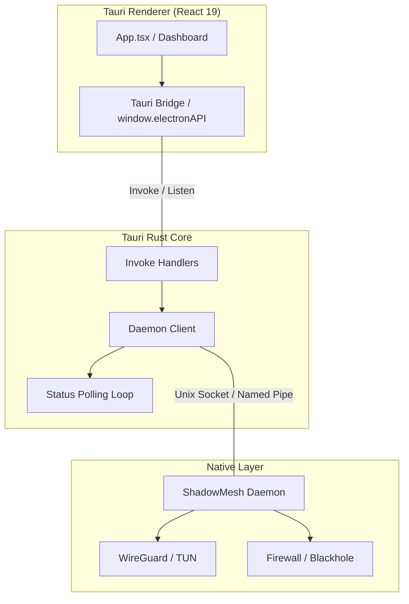

# 🔧 Desktop Technology Documentation (v0.1.0 — Alpha Initial)

**Framework**: Tauri v2 + React 19 + TypeScript  
**Backend**: Rust (Tauri Core)  
**Native Bridge**: Rust (ShadowMesh Daemon)  
**Location**: `/desktop/`

---

## Architecture Overview



---

## Directory Structure

```
desktop/
├── src-tauri/               # Tauri Rust Core (v2)
│   ├── src/
│   │   ├── lib.rs           # Plugin init, Commands, Daemon IPC logic
│   │   └── main.rs          # Entry point
│   ├── capabilities/        # Permission & Security definitions
│   └── tauri.conf.json      # Security (CSP) & Build config
├── src/
│   ├── renderer/            # React application
│   │   ├── tauri-bridge.ts  # Electron-to-Tauri API Adapter
│   │   ├── App.tsx          # Main dashboard
│   │   └── main.tsx         # Bridge injection
│   └── types/               # Type definitions
└── tests/                   # Vitest & E2E tests
```

---

## Core Features (v4.4.0)

### 1. Tauri Migration (Performance & Security)
- **RAM Efficiency**: Idle usage reduced from ~150MB to <30MB by replacing Chromium/Electron with system-native WebViews.
- **Security Hardening**: 
  - Strict Content Security Policy (CSP).
  - Rust-based daemon management (No privileged Go helper required).
  - Scoped filesystem and plugin permissions via Tauri's capability system.

### 2. High-Entropy Activation (Hardening)
- Supported via the unified `run_helper` bridge.
- Enforces the 25-character alphanumeric standard (`XXXXX-XXXXX-XXXXX-XXXXX-XXXXX`).

### 3. Daemon Integration
- **Rust Daemon**: Executed as a background service or Tauri sidecar.
- **Communication**: Rust proxies commands from the renderer to the Daemon via secure async IPC (Unix Sockets on Linux/macOS, Named Pipes on Windows).
- **Status Polling**: A dedicated Rust async task polls the daemon every 3s and emits events to the renderer.

### 4. Out-Of-Band pairing & PIN Cipher (v4.4.0)
- **Mathematical exchange**: Full prime-based Diffie-Hellman Key Exchange using 256-bit BigInt exponentiation.
- **PIN Key derivation**: visual 6-digit PIN symmetric stream cipher encrypts raw config payloads, preventing over-the-shoulder capture.
- **Session emergency kill-switch**: Revokes active pairings in volatile cached registries instantly.

---

## Testing Strategy

- **Unit/Integration (Vitest)**: Validates React components and the `tauri-bridge` mapping.
- **Rust Tests**: (Planned) Unit tests for the sidecar command logic in `lib.rs`.
- **E2E (Playwright)**: Adapting for Tauri-native testing.

---

**Version**: 4.4.0  
**Maintainer**: ShadowMesh Core Team  
