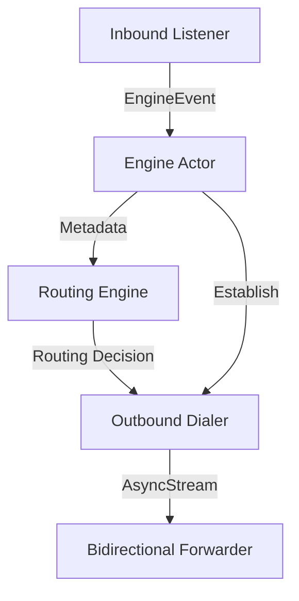

# ShadowMesh Core Architecture

## Goals
- **Independence**: A clean-room Rust implementation free from GPL-derived logic.
- **Performance**: High throughput and low latency via async-driven I/O and sharded state.
- **Security**: Audited crypto, secure defaults, and memory safety.
- **Type Safety**: Strongly typed internal representations (IR) for protocols and routing.

## Non-Goals
- Being a bug-for-bug compatible clone of `sing-box` or `Xray`.
- Supporting every obscure legacy protocol without a clear specification.

## Architectural Principles
1. **Ownership-Driven**: Leverage Rust's borrow checker to manage resource lifecycles without excessive locks.
2. **Event-Driven & Actor-Based**: Components communicate via typed events sent to a central `EngineActor` using asynchronous channels.
3. **Specification-First**: Implementation must be derived from RFCs and official protocol documentation.
4. **Strongly Typed IR**: Protocols are parsed into structured types before any logic is applied.

## Module Boundaries
- `foundation/`: Core types, error handling, and identity.
- `transport/`: Low-level stream and packet abstractions (TCP, UDP).
- `protocol/`: Typed parsers and handlers for DNS, TLS, HTTP, etc.
- `routing/`: Policy evaluation and routing decisions based on Connection IR.
- `inbound/`: Interface listeners (TUN, SOCKS, HTTP).
- `outbound/`: Destination dialers and proxy client implementations.
- `session/`: Connection state and lifecycle management (Registry).
- `engine/`: The actor loop and orchestration runtime.
- `platform/`: OS-specific optimizations (Socket tuning, zero-copy).

## Concurrency & Ownership
- Use **sharded state** and **actor-like components** to minimize lock contention.
- Mandatory use of `async-channel` for inter-component communication.
- Minimize use of `Arc<Mutex<T>>` in the high-frequency data path.

## Event Flow

## Security Boundaries
- Cryptographic keys are isolated and zeroized when dropped.
- Parsing is performed in a validated pipeline to prevent memory corruption or injection.
- Resource limits are enforced at the session and engine levels to prevent DoS.

## Observability
- Structured tracing for all routing decisions and lifecycle events.
- Metrics for throughput, latency, and resource utilization per `DEBUGGABILITY.md`.
